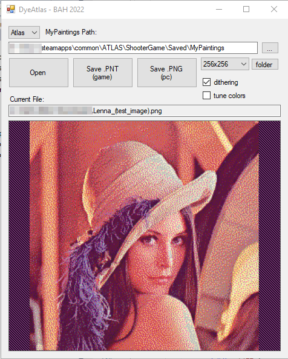

# DyeAtlas
atlas/ark texture utility for  PNT to/from PNG

## Overview

#### Features
* Game selector for Ark/Atlas
* Drag'n'drop for loading any file type
* Save as .PNT or .PNG
* Remembers your MyPaintings path;  has button to open that folder in Windows
* Supports typical image formats (.BMP / .PNG / .JPG / .GIF)
* Select 128x128 or 256x256  .PNT output   (auto-detected)
* Built-in dithering option
* Built-in Hue/Saturation/Brightness color tuning option
